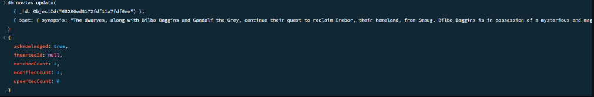
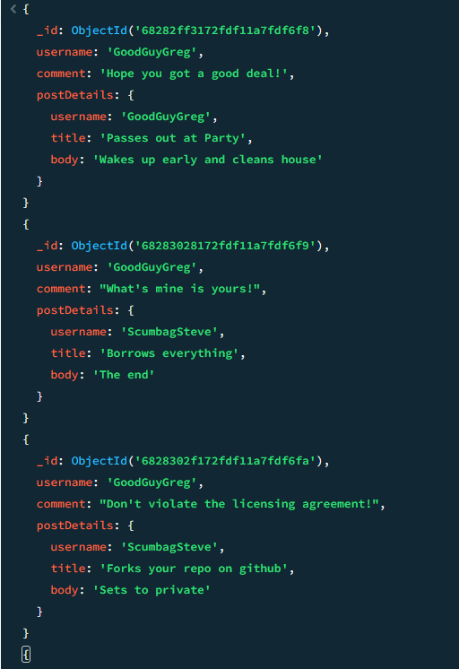

# Finals Lab Task 6 - MongoDB Practice

## MongoDB exercise using the mongo shell, along with the step-by-step instruction and commands

## Query/Find Documents
1. Get all documents

2. Get all documents with writer set to Quentin Tarantino

3. Get all documents where actors include Brad Pitt

4. Get all documents with franchise set to The Hobbit

5. Get all movies released in the 90s

6. Get all movies released before the year 2000 or after 2010

# Update Documents

# Text Search

 1.Find all movies that have a synopsis that contains the word Bilbo

2. Find all movies that have a synopsis that contains the word &Gandalf

3. Find all movies that have a synopsis that contains the word Bilbo& and not the word Gandalf

4. Find all movies that have a synopsis that contains the word dwarves or hobbit

5. Find all movies that have a synopsis that contains the word gold and dragon, get all movies released in the 90s

# Delete Documents
1. Delete the movie Pee Wee Hermans Big Adventure

2. Delete the movie Avatar

# Relationships

